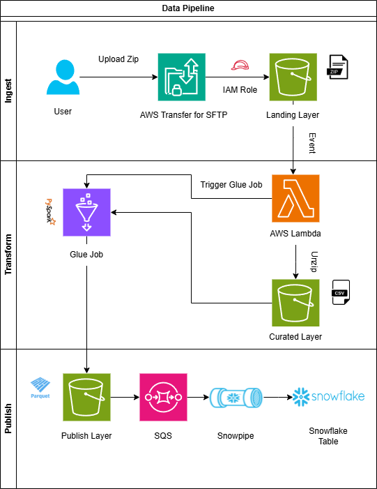

# Data Pipeline Project

## Overview

This project presents a streamlined, serverless data pipeline that seamlessly orchestrates file transfers, transformations, and ingestion into a cloud ecosystem.

## Architecture

### Ingest Stage

1. **Uploading Files:** A third-party or vendor securely uploads zipped files using AWS Transfer for SFTP, ensuring data protection and compliance.
2. **Landing Layer:** The uploaded files are stored in an **Amazon S3 bucket under the Landing Layer**.
3. **Event Notification:** An S3 event triggers an AWS Lambda function.

### Transform Stage

4. **AWS Lambda Processing:** The Lambda function unzips the files and moves them to the **Curated Layer within the same S3 bucket**.
5. **AWS Glue Job:** A Glue job processes the CSV files, transforming them into Parquet format for optimized storage and analytics.

### Publish Stage

6. **Publish Layer:** Transformed data is stored in the **same S3 bucket under the Publish Layer**.
7. **SQS Notification:** An Amazon SQS event triggers Snowpipe for real-time data ingestion.
8. **Snowflake Table:** The ingested data is stored in Snowflake for querying and analysis.

## Technologies Used

- **AWS Transfer for SFTP** (Secure file transfer)
- **Amazon S3** (Data storage)
- **AWS Lambda** (Event-driven processing)
- **AWS Glue** (Data transformation)
- **Amazon SQS** (Event notification)
- **Snowpipe & Snowflake** (Real-time data ingestion and analytics)

## 📽️ Video Demonstration

https://github.com/user-attachments/assets/c9440c9a-fcaa-44cd-b70b-4f30713319e0

## Conclusion

This pipeline provides a scalable and serverless approach to handling file transfers, processing, and real-time analytics using AWS and Snowflake.

